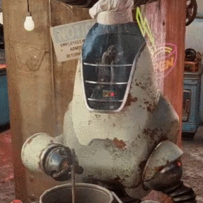

  

<table align='center' style='overflow:initial'>
  <tr> 
    <h3 >
      <a href="https://github.com/SpookyJelly" rel="noreferrer">🤣 Tell me a joke</a>
    </h3>
  <tr>
  <tr> 
    <h3>
      <a href="https://fallout.fandom.com/wiki/Noodle_cup_(Fallout_4)" rel="noreferrer">😊 Yes</a>
    </h3>
  <tr>
  <tr> 
    <h3>
      <a href="https://spookyjelly.tistory.com/" rel="noreferrer">🧐 My blog</a>
    </h3>
  </tr>
</table>

<h2>
  <a href='https://fallout.fandom.com/wiki/Takahashi' rel="noreferrer">Meme Explained</a>
</h2>

## Interested on..

* Vite
* FP /RP
* Typescript
* Next.js

